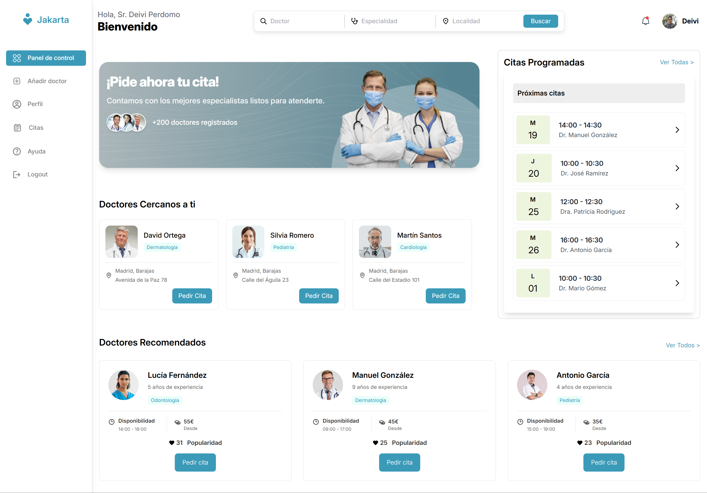
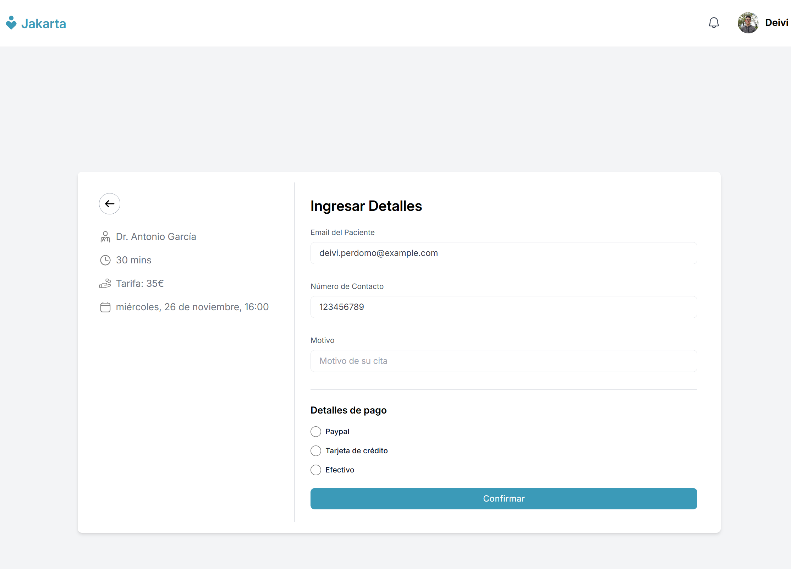
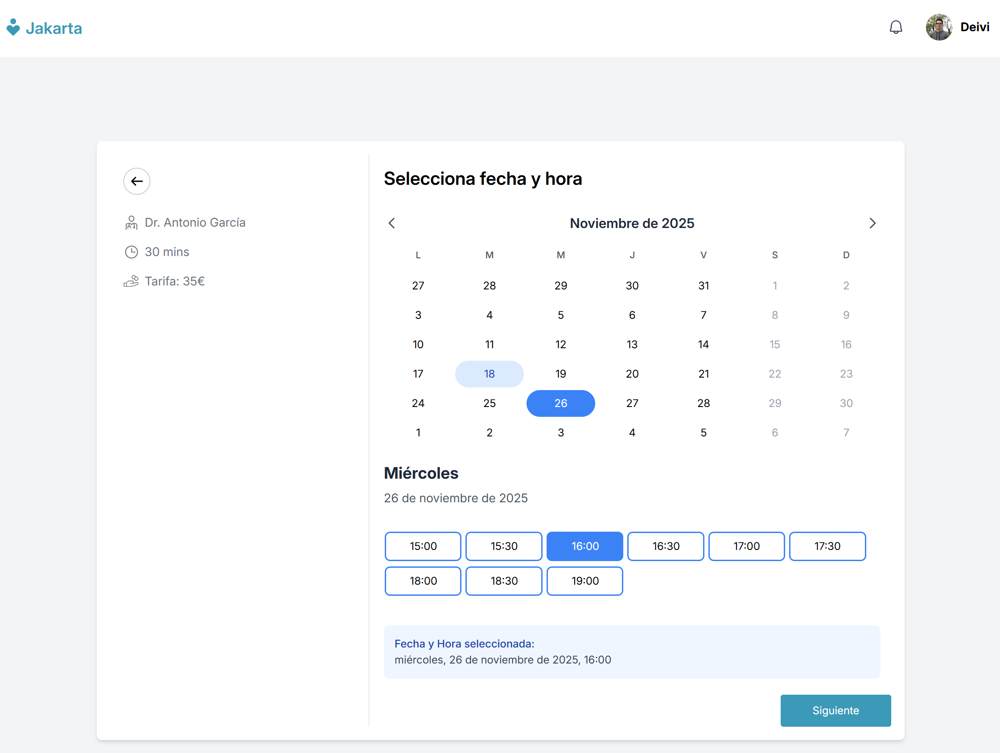
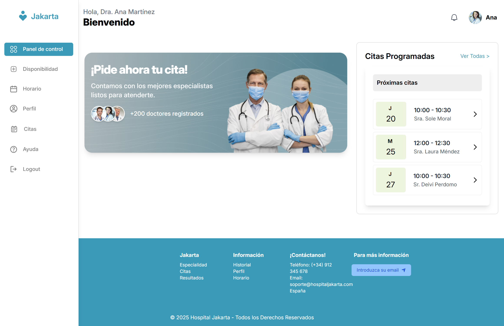
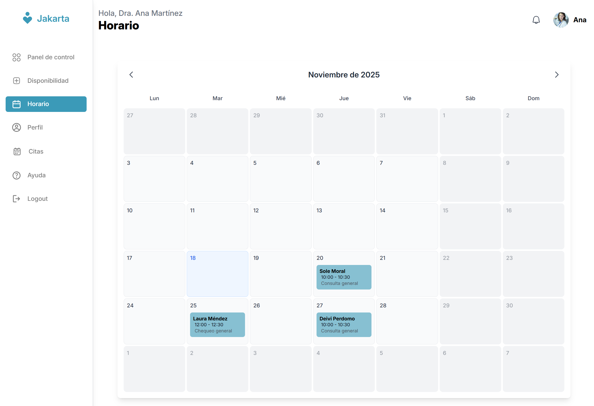
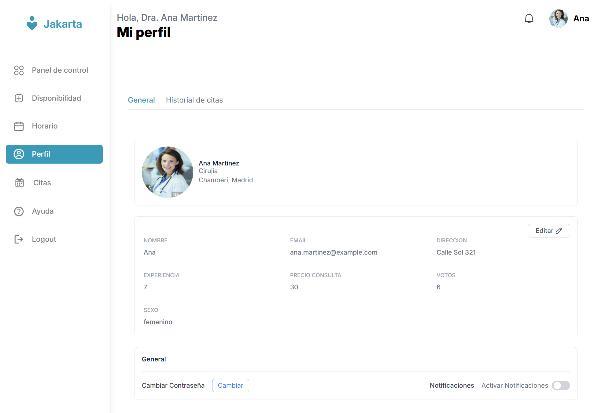

<div align="center">

# 🏥 Hospital Management System

### *Gestión Hospitalaria Moderna e Inteligente*



<br/>

[](https://openjdk.org/)
[](https://spring.io/projects/spring-boot)
[](https://angular.io/)
[](https://www.mysql.com/)
[](LICENSE)

</div>

---

## 📋 Descripción

Una aplicación web completa para la gestión hospitalaria que permite administrar pacientes, médicos, citas médicas y otros recursos del hospital de manera eficiente y moderna. Desarrollada con las últimas tecnologías y mejores prácticas de la industria.

## ✨ Características Principales

| Funcionalidad | Descripción |
|--------------|-------------|
| 👥 **Gestión de Pacientes** | Registro, consulta y actualización completa de información de pacientes |
| 👨‍⚕️ **Gestión de Médicos** | Administración de personal médico, especialidades y horarios |
| 📅 **Sistema de Citas** | Programación inteligente y seguimiento de citas médicas |
| 🔌 **API REST** | Backend robusto con documentación automática Swagger/OpenAPI |
| 🎨 **Interfaz Moderna** | Frontend responsive y accesible con Tailwind CSS |
| 💾 **Base de Datos** | Persistencia confiable y escalable con MySQL 8.0 |
| 🔒 **Seguridad** | Validación de datos y arquitectura segura |
| 📱 **Responsive** | Diseño adaptable a todos los dispositivos |

## 🛠️ Stack Tecnológico

<table>
<tr>
<td width="50%" valign="top">

### 🔧 Backend

```yaml
Lenguaje: Java 21
Framework: Spring Boot 3.4.2
Persistencia: Spring Data JPA
Base de Datos: MySQL 8.0
Build Tool: Maven
Utilidades:
  - Lombok
  - Bean Validation
  - OpenAPI/Swagger
```

</td>
<td width="50%" valign="top">

### 🎨 Frontend

```yaml
Framework: Angular 19
Lenguaje: TypeScript
Estilos: Tailwind CSS
Reactividad: RxJS
Build Tool: Angular CLI
Características:
  - Componentes modulares
  - Diseño responsive
```

</td>
</tr>
</table>

## 📁 Estructura del Proyecto

```
hospital-app/
├── back/                    # Backend (Spring Boot)
│   ├── src/
│   │   ├── main/java/
│   │   └── test/java/
│   ├── pom.xml
│   └── mvnw
├── front/                   # Frontend (Angular)
│   ├── src/
│   │   ├── app/
│   │   ├── assets/
│   │   └── index.html
│   ├── package.json
│   └── angular.json
└── README.md
```

---

## 🚀 Instalación y Configuración

### 📋 Prerrequisitos

Asegúrate de tener instaladas las siguientes herramientas:

| Herramienta | Versión Mínima | Descarga |
|------------|----------------|----------|
| ☕ Java | 21+ | [OpenJDK](https://openjdk.org/) |
| 📦 Node.js | 18+ | [nodejs.org](https://nodejs.org/) |
| 🗄️ MySQL | 8.0+ | [MySQL](https://www.mysql.com/) |
| 🔨 Maven | 3.6+ | [Maven](https://maven.apache.org/) |
| 📦 npm/yarn | Latest | Incluido con Node.js |

---

### 🔧 Backend (Spring Boot)

<details>
<summary><b>👉 Click para ver instrucciones detalladas</b></summary>

#### 1️⃣ Clonar el repositorio
```bash
git clone https://github.com/deperdomo/hospital-app.git
cd hospital-app/back
```

#### 2️⃣ Configurar la base de datos
```sql
CREATE DATABASE hospital_db;
CREATE USER 'hospital_user'@'localhost' IDENTIFIED BY 'hospital_pass';
GRANT ALL PRIVILEGES ON hospital_db.* TO 'hospital_user'@'localhost';
FLUSH PRIVILEGES;
```

#### 3️⃣ Configurar `application.properties`
```properties
# Configuración de la base de datos
spring.datasource.url=jdbc:mysql://localhost:3306/hospital_db
spring.datasource.username=hospital_user
spring.datasource.password=hospital_pass
spring.datasource.driver-class-name=com.mysql.cj.jdbc.Driver

# Configuración de JPA
spring.jpa.hibernate.ddl-auto=update
spring.jpa.show-sql=true
spring.jpa.properties.hibernate.dialect=org.hibernate.dialect.MySQLDialect

# Puerto del servidor
server.port=8080
```

#### 4️⃣ Ejecutar la aplicación
```bash
# Usando Maven Wrapper (recomendado)
./mvnw spring-boot:run

# O usando Maven instalado
mvn spring-boot:run
```

</details>

---

### 🎨 Frontend (Angular)

<details>
<summary><b>👉 Click para ver instrucciones detalladas</b></summary>

#### 1️⃣ Navegar al directorio frontend
```bash
cd ../front
```

#### 2️⃣ Instalar dependencias
```bash
npm install
```

#### 3️⃣ Ejecutar la aplicación en modo desarrollo
```bash
# Usando npm
npm start

# O usando Angular CLI directamente
ng serve
```

</details>

---

## 🌐 URLs de Acceso

### 🖥️ Desarrollo

| Servicio | URL | Descripción |
|----------|-----|-------------|
| 🎨 **Frontend** | [http://localhost:4200](http://localhost:4200) | Interfaz de usuario |
| 🔌 **Backend API** | [http://localhost:8080](http://localhost:8080) | API REST |
| 📚 **Swagger UI** | [http://localhost:8080/swagger-ui.html](http://localhost:8080/swagger-ui.html) | Documentación interactiva |

### 🔗 Endpoints Principales

```http
GET    /api/patients       # Listar todos los pacientes
POST   /api/patients       # Crear nuevo paciente
GET    /api/doctors        # Listar todos los médicos
POST   /api/appointments   # Crear cita médica
GET    /api/appointments   # Listar citas
```

---

## 🧪 Testing

<table>
<tr>
<td width="50%">

### Backend Tests
```bash
cd back
./mvnw test

# Con cobertura
./mvnw test jacoco:report
```

</td>
<td width="50%">

### Frontend Tests
```bash
cd front
npm test

# Con cobertura
npm run test:coverage
```

</td>
</tr>
</table>

---

## 📦 Construcción para Producción

<table>
<tr>
<td width="50%" valign="top">

### 🔧 Backend

```bash
cd back
./mvnw clean package
```

**Output:** `target/hospital-api-0.0.1-SNAPSHOT.jar`

```bash
# Ejecutar JAR
java -jar target/hospital-api-0.0.1-SNAPSHOT.jar
```

</td>
<td width="50%" valign="top">

### 🎨 Frontend

```bash
cd front
npm run build
```

**Output:** `dist/` directory

```bash
# Servir producción localmente
npx http-server dist/front-hospital
```

</td>
</tr>
</table>

## 🐳 Docker (Opcional)

### Backend
```dockerfile
FROM openjdk:21-jre-slim
COPY target/hospital-api-0.0.1-SNAPSHOT.jar app.jar
EXPOSE 8080
ENTRYPOINT ["java","-jar","/app.jar"]
```

### Frontend
```dockerfile
FROM node:18-alpine AS build
WORKDIR /app
COPY package*.json ./
RUN npm install
COPY . .
RUN npm run build

FROM nginx:alpine
COPY --from=build /app/dist/front-hospital /usr/share/nginx/html
EXPOSE 80
```

## 🤝 Contribución

Las contribuciones son bienvenidas. Por favor:

1. Fork el proyecto
2. Crea una rama feature (`git checkout -b feature/AmazingFeature`)
3. Commit tus cambios (`git commit -m 'Add some AmazingFeature'`)
4. Push a la rama (`git push origin feature/AmazingFeature`)
5. Abre un Pull Request

## 📝 Convenciones de Código

### Backend
- Uso de **Lombok** para reducir boilerplate
- Validaciones con **Bean Validation**
- Nomenclatura en inglés para entidades y servicios
- Documentación con **JavaDoc**

### Frontend
- Seguir **Angular Style Guide**
- Uso de **TypeScript** estricto
- Componentes modulares y reutilizables
- Estilos con **Tailwind CSS**

## 🐛 Problemas Conocidos

- Pendiente implementar autenticación JWT
- Falta sistema de notificaciones en tiempo real
- Necesita implementar paginación en listados

## 📄 Licencia

Este proyecto está bajo la Licencia MIT. Ver el archivo `LICENSE` para más detalles.

---

## 👨‍💻 Autores

<table>
  <tr>
    <td align="center">
      <a href="https://github.com/smoral1">
        <br />
        <sub><b>@smoral1</b></sub>
      </a>
    </td>
    <td align="center">
      <a href="https://github.com/DiegoMartzG">
        <br />
        <sub><b>@DiegoMartzG</b></sub>
      </a>
    </td>
    <td align="center">
      <a href="https://github.com/deperdomo">
        <br />
        <sub><b>@deperdomo</b></sub>
      </a>
    </td>
  </tr>
</table>  


## 🆘 Soporte

Si tienes alguna pregunta o problema, por favor:

1. Revisa los [Issues existentes](https://github.com/deperdomo/hospital-app/issues)
2. Crea un [nuevo Issue](https://github.com/deperdomo/hospital-app/issues/new) si es necesario
3. Incluye detalles del problema y pasos para reproducirlo

---

## 📸 Capturas de Pantalla

### 👤 Panel de Usuario

<table>
  <tr>
    <td align="center">
      
      <br />
      <sub><b>Dashboard Principal</b></sub>
    </td>
    <td align="center">
      
      <br />
      <sub><b>Agendar Cita</b></sub>
    </td>
  </tr>
  <tr>
    <td align="center" colspan="2">
      
      <br />
      <sub><b>Mis Citas Programadas</b></sub>
    </td>
  </tr>
</table>

### 👨‍⚕️ Panel de Doctor

<table>
  <tr>
    <td align="center">
      
      <br />
      <sub><b>Dashboard del Médico</b></sub>
    </td>
    <td align="center">
      
      <br />
      <sub><b>Calendario de Citas</b></sub>
    </td>
  </tr>
  <tr>
    <td align="center" colspan="2">
      
      <br />
      <sub><b>Perfil Profesional</b></sub>
    </td>
  </tr>
</table>


---

<div align="center">

### ⭐ Si este proyecto te ha sido útil, ¡no olvides darle una estrella!

**Hecho con ❤️ por el equipo de Hospital Management System**

[⬆ Volver arriba](#-hospital-management-system)

</div>
